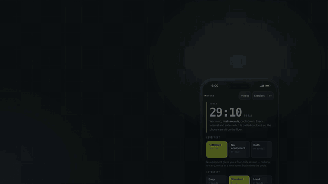

# KB Core

A daily kettlebell **core workout** web app. Offline-capable PWA, no build step,
no dependencies — just static files. Live at **[kb-core.vercel.app](https://kb-core.vercel.app)**.



[Full-quality video (21 s, 1080p)](docs/demo.mp4)

Built because every interval timer I tried either had no exercise demos, or
buried the controls, or wouldn't work without a network connection at 6am.

## Features

- **One-tap sessions** — pick equipment (kettlebell / no equipment / both), intensity
  (easy / standard / hard + finisher) and a focus (lower abs, obliques, anti-rotation…);
  it builds warm-up, main rounds and cool-down
- **Honest focus chips** — a focus with no moves in the current equipment mode goes
  grey instead of producing an empty session
- **Edit before you start** — swap, remove or reorder moves, or regenerate a fresh mix
- **60s work / 20s rest by default** — editable work, rest, rounds and prep
- **99 exercises** (50 kettlebell, 49 bodyweight), each a short looping demo clip cut
  from public YouTube tutorials, with step-by-step cues and a timestamped source link
- **Exercise library** — browse every movement with form cues *without* starting a session
- **Session preview** — see the full ordered workout before you begin, and what's
  coming up mid-session
- **Real transport controls** — pause, resume, skip, previous, ±time, end
- **Unilateral handling** — half the configured work interval per side (30s each
  at the default 60s), with an audible switch cue at the halfway mark
- **Audio cues** — WebAudio tones (no audio files), so transitions are audible with
  the phone face-down
- **Screen wake lock**, re-acquired when the tab returns to the foreground
- **Offline** via service worker — open once online to cache the app, then use it
  from Home Screen or the browser. Demo clips cache on first play; play the clips
  you need before going offline. Original YouTube videos require a connection
- **Drift-corrected timer** — elapsed time computed from a single
  `performance.now()` origin, never accumulated `setInterval` ticks

## Run it locally

```bash
python3 -m http.server 8000
# open http://localhost:8000
```

That's it. No `npm install`, no bundler, no framework.

## Structure

```
index.html        markup + all four views
styles.css        all styling
app.js            timer engine, session builder, transport controls, settings, history
library.js        exercise library, session preview, upcoming list
exercises.json    99-exercise catalogue (cues, steps, focus tags, muscles, source credits)
workout.json      default session structure
media/            <id>.mp4 demo loops + <id>.jpg posters
docs/             demo video + README GIF (app UI only, no third-party footage)
sw.js             offline cache
```

## Notes on the media

Demo clips are short excerpts cut from publicly available YouTube tutorials,
used here for personal, non-commercial reference. Every exercise credits its
source channel and links back to the original video in the app. If you're a
creator and want a clip removed, open an issue.

Encoding: H.264 baseline, `yuv420p`, `+faststart`, no audio track. The 99 demo
clips comprise 88 at 640x360, 10 at 360x640 and one at 360x480.

Maintenance correction (2026-09-28): inspecting every clip corrected the earlier
480x480 description. The old GIF/WebP/MP4 size comparison was removed because
it did not identify its input clip or provide a reproducible encoding command.
The offline description now clarifies that clips must be cached before travel.

## Design decisions worth knowing

- **Never `await` audio or wake-lock before starting a session.**
  `await audioContext.resume()` can hang indefinitely, which leaves a dead Start
  button. Both are fire-and-forget. (This was a real shipped bug.)
- **Wake lock is silently released when the tab backgrounds** and does not return
  on its own — it's re-requested on `visibilitychange`.
- **Session duration** is `prep + n*work + (n-1)*rest` — there's no rest after the
  final interval.
- Videos need all four of `autoplay loop muted playsinline` plus a `poster`;
  every one is load-bearing on iOS Safari.

## Training caveat

Heavy loaded core work *every single day* isn't a great idea — it competes with
endurance training for recovery. That's why there's an intensity selector. The
habit stays daily; the load doesn't. Day after a long ride or brick session,
pick Easy.

Not medical or coaching advice. Use a weight you can control with a neutral spine.

## Licence

MIT for the code. Media clips are excerpts from third-party videos — see above.
